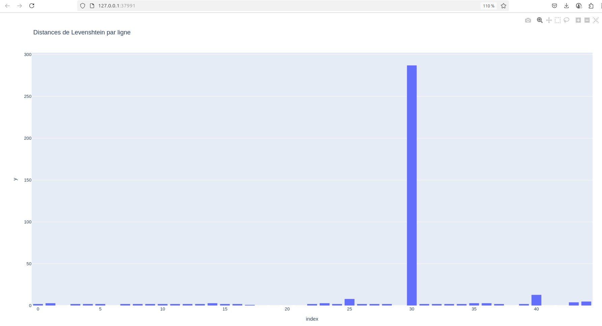
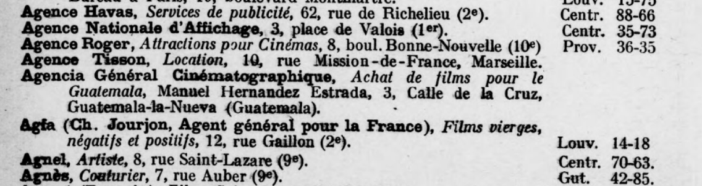

# Structured output from text (ocr) via Mistral API 

> Sources : https://docs.mistral.ai/capabilities/structured-output/custom_structured_output/

Create virtual environment, enable it and :

```
pip install -r requirements.txt
```

Then run `python3 main.py` or `python main.py`

## Evaluation:

(à faire)
- Vérité terrain
    - A partir de CSV plutôt que JSON pour faire des tests aussi avec SQL et recherche floue?
- Normaliser les strings (ponctuation + bas de casse etc.)
- Calcul des distances 

- Pour le traitement API-->JSON, utiliser **async**

> Sources :
> - truth ground 01 : https://gallica.bnf.fr/ark:/12148/bd6t543024772/f28.item

### Idées

- démo géocodage des adresses via folium

### Notes

Regex pour nettoyer sur la vérité terrain les espaces en général contenues dans les parenthèses

> Voir fonctions de normalisation du benchmark

```Regex
(?<=\(\d)\ 
(?<=\d)\ (?=\w)
\d(\ )\w*
\ (?=\))
((?<=\d)\ (?=\w.*\ \)))
```

Comme `diff` pour aperçu :

```shell
diff -h -b --color json_converted.csv truth_grnd_01.csv 
```

> La somme des distances de Levenshtein entre les mots individuels d'une liste n'est pas nécessairement égale à la distance de Levenshtein entre les chaînes concaténées des deux listes. 

Aberrations à cause de l'OCR : se mêlent les margent et le labeur, d'où le pic.




Comment déterminer le seuil minimal de distance de LEv ? Voir si ce qui est couvert par la recherche floue

---
FAire chemin global de la chaine de traitement

1) Prompt pour générer données
2) Evaluation quantitative avec vérité terrain ===> Projection (simplification) ==> matrice d'appariment en fonction des distances de lev (demadner à vérifier méthodo) ===> scoring; et fonction de densité de Prédiction /Expected 1, P1/E3, p1 étant prédiction == scoring
3) Valoriser avec données des Tables
4) évalutation quali presque une détection d'hallucinations (visualisation des présence et absences)
5) Débats / ciné


échantilloange et vérité terrain : prendre zone représentative: 5 groupes de pages.
