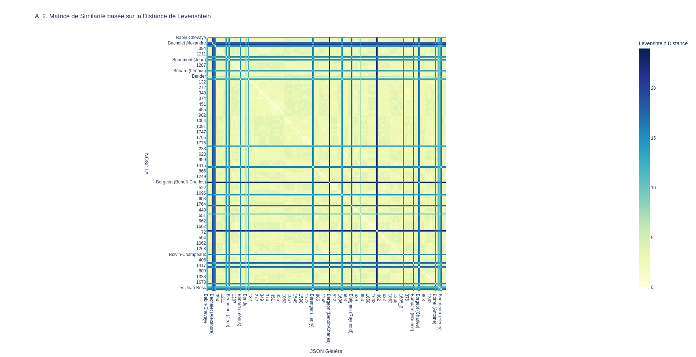

Source : 

 .

### Notes 

Pour les VT, j'ai choisi quatre niveaux de granularité :

- un niveau "haut" avec 1) des rôles (qui précisent si l'intervenant au Sénat n'est pas un sénateur, par exemple un ministre ou un secrétraire); 2) une liste d'actions concernant l'intervenant auxquelles sont toutes associées 3) des références de pages (int) sauf si 4) il s'agit d'un renvoi vers une autre entrée

- un niveau "moyen" qui est la même chose que le niveau haut moins les rôles

- un niveau "bas" où les références de pages ne sont pas extraites comme des entiers, mais font parties de la description.

- une niveau "épuré" ou seuls les noms des sénateurs et les pages où ils apparaissent sont mentionnés (utile pour faire un "Zeitgeist-like" de Google par exemple)

Plus le niveau de granularité est haut, plus il y a d'erreurs; car il y a *par exemple* la difficulté pour le LLM de bien distribuer les descriptions.

Par exemple le texte brut: 
>`"Parle: discuss. d'un projet de loi portant fixation du budget général de l'exercice 1931-1932 (Instruction publique), p. 582; (Postes, télégraphes et téléphones), p. 719."` 

devient

```JSON
{
          "action": {
            "description_action": "Parle: discuss. d'un projet de loi portant fixation du budget général de l'exercice 1931-1932 (Instruction publique)",
            "references_page": [
              582
            ]
          }
        },
        {
          "action": {
            "description_action": "Parle: discuss. d'un projet de loi portant fixation du budget général de l'exercice 1931-1932 (Postes, télégraphes et téléphones)",
            "references_page": [
              719
            ]
          }
        }
```

Si c'est un format très intéressant (on a la référence de page pour chaque action de façon indépendante), malheuresement ça implique le LLMs à faire des choix :

En effet, le LLM a ici répété ce qui permet de contextualiser une action, qui pourrait d'ailleurs être considérée comme un moment/étape d'une l'action. C'est une bonne idée que je n'avais pas envisagé au départ et que j'ai décidé de garder pour établir la VT. 

Malheureusement, cette *distribution* des éléments de contexte (ou des moments/étapes d'une action) échoue pour certains cas, à moins de réécrire le texte (ce qui impliquerait, j'imagine une température > 0, ce qui poserait probleme ?). C'est notamment le cas pour l'entrée Beaumont Jean où la "fixation de la date de la discussion" n'a pas de contexte, car ce dernier est aussi une typologie d'action différente (interpellation). Répéter cette action pour en introduire une autre d'une nature implique une contradiction (ou du moins une répétition qui n'est pas la bienvenue).

Egalement le probleme de la précision des pages où sont déposés les amendements : parfois, il est précisé à quelle page un amendement a été déposé. Malheureusement, il est difficile de trancher s'il s'agit là aussi d'une autre action et sinon, comment séparer l'information sans complexifier encore le modèle, ce qui serait porteur de nouvelles erreurs.

Il arrive aussi parfois, (assez rarement, à voir au moment de l'évaluation) que le LLM ignore des portions de phrases.

L'hypothèse de d'une granularité plus basse, avec seulement des distictions entre les différentes actions, semble ne produire aucune erreur (en tout cas pour la correction de la VT). 

> exemple :

```JSON
 {
      "nom": "Beaumont",
      "prenom": "Jean",
      "actions_relatives_a_l_intervenant": [
        "Parle: discuss. d'un projet de loi portant fixation du budget général de l'exercice 1931-1932 (Agriculture), p. 477.",
        "Demande à interpeller sur les mesures que compte prendre le Gouvernement pour prévenir les crises agricoles, notamment celles qui sévissent sur l'élevage national que préparent les importations massives de matières alimentaires, p. 1087; parle: fixation de la date de la discuss., p. 1130; développe son interpellation, p. 1287.",
        "Parle : discuss. d'un projet de loi relatif à l'outillage national, p. 1667, 1674, 1708."
      ]
    },
    {
      "nom": "Bénard",
      "prenom": "Léonus",
      "actions_relatives_a_l_intervenant": [
        "Parle: discuss. d'un projet de loi relatif au crédit colonial, p. 146, 148.",
        "Dépose et lit son rapport sur un projet de loi désignant un nouveau lieu de déportation, p. 832."
      ]
    },
```

Certes, les numéros de pages sont solidaires au texte, mais une extraction *a posteriori* via une regex est moins incertain que de laisser le LLM à produire des distinctions/séparations qui impliquent un risque de confusion, car le forçant à trancher (cf. le cas des amendements déposés et/ou du probleme de la distribution du contexte). L'approche "moins c'est plus" pose le probleme que l'historien/utilisateur de l'outil corpusense qui voudrait exploiter le texte, n'aura pas les données "toutes prêtes" car il faudrait extraire les numéros de page avec la Regex, sauf si cette extraction fait partie du workflow... Tout dépend aussi de quel historien.ne fait le traitement; ou encore de quel contexte de recherche il s'agit. (Difficile de séparer l'outil technique de son contexte social de production comme dirait Simondon !... ou encore Karl Marx haha)

Une autre solution intermédiaire (à voir si c'est intéressant) est de garder et tout le texte de la description (pages incluses) et les numéros de pages comme des entiers dans une liste à part. Exemple :

```JSON

  "listes_des_intervenants": [
    {
      "nom": "Babin-Chevaye",
      "prenom": "",
      "actions_relatives_a_l_intervenant": [
        "Est proclamé secrétaire du Sénat, p. 8.",
        "Parle: discuss. d'un projet de loi portant fixation du budget général de l'exercice 1931-1932 (Instruction publique), p. 582; (Postes, télégraphes et téléphones), p. 719."
      ],
      "references_pages": [
        8,
        582,
        719
      ]
    },
    {
      "nom": "Bachelet",
      "prenom": "Alexandre",
      "nom_entree_du_renvoi": "V. Alexandre Bachelet"
    },
    {
      "nom": "Barthou",
      "prenom": "Louis",
      "actions_relatives_a_l_intervenant": [
        "Son allocution à l'occasion du décès du maréchal Joffre, p. 2.",
        "Parle: discuss. d'un projet de loi relatif à l'exploitation des lignes de l'aéropostale, p. 394, 396, 397, 399.",
        "Son amendement déposé au cours de la discuss. d'un projet de loi portant ouverture et annulation de crédits sur l'exercice 1930-1931 au titre du budget général et des budgets annexes, p. 1211.",
        "Parle : rectification au procès-verbal, p. 1237."
      ],
      "references_pages": [
        2,
        394,
        396,
        397,
        399,
        1211,
        1237
      ]
    }
  ]
```

Ou bien de demander au LLMS de ne pas séparer les différents moments d'une action. On le voit, il y a beaucoup de possibilités et qui dépendent ici du prompting. Malheureusement, la complexité de la formulation pourrait rendre difficile le passage du particulier au général, sur d'autres pages du J.O. réputées inconnues...

On voit que le probleme de constituer une vérité terrain semble simple de prime abord. Mais la structuration des données, même dans un scénario optimal de machines avec 100% de succès qu'est censé représenter la VT, implique quand même de trancher et d'abandonner certaines spécifictés documentaires, à l'instar celles des Tables et ce malgré la rigueur de la composition. On pourrait bien sur établir un niveau de granularité extrêmement fin qui rendent compte des spécificités sur une ou deux pages.... mais impossible de le savoir *a priori* pour des dizaines, des centaines voire des milliers de page. Faire un modèle de représentation des données implique nécessairement de "gommer" le grain atomique de la matière documentaire -- et le commentaire le plus exhaustif de quelque chose c'est la chose elle-même comme a du dire Todorov (je crois) dans "Poétique".

#### NB : autre proposition

Pour effectuer un Zeitgeist-like (façon Google), une autre proposition, sans les actions des sénateurs :

```JSON
{
            "nom": "Boivin-Champeaux",
            "references_page": [
                1,
                344,
                376,
                379,
                406,
                784,
                1590
            ]
        },
        {
            "nom": "Bompard Maurice",
            "references_page": [
                754
            ]
        },
        {
            "nom": "Bon",
            "references_page": [
                1417
            ]
        },
```

## Produire résultats statistiques à partir de la VT (page 2):

### A) CREER DES MATRICES

`generer_matrices.py`

Cas où la page commence par une entrée et dernière entrée non coupée. ((ici j'ai masque pour tous les cas les orphelines))

Avec Modèle épuré
	- 1. Obtenir Matrice de coût (lev) avec la génération structurée depuis OCR Corrigé
	- 2. Obtenir Matrice de coût (lev) avec la génération structurée depuis OCR avec Zone manuelles via CORPUSENSE
	- 3. Obtenir Matrice de coût (lev) avec la génération structurée depuis OCR avec Zone obtenues via Document Layout Detection via CORPUSENSE 
	- 4. Obtenir Matrice de coût (lev) avec la génération structurée depuis OCR brut ?

Aevc Modèle Moyen
	- 5. Obtenir Matrice de coût (lev) avec la génération structurée depuis OCR Corrigé
	- 6. Obtenir Matrice de coût (lev) avec la génération structurée depuis OCR avec Zone manuelles
	- 7. Obtenir Matrice de coût (lev) avec la génération structurée depuis OCR avec Zone obtenues via Document Layout Detection
	- 8. Obtenir Matrice de coût (lev) avec la génération structurée depuis OCR brut ?

A.0 Matrice de coût entre la vérité terrain JSON vers elle-même pour avoir un référentiel


A.1 Matrice de coût (lev) avec la génération structurée depuis OCR Corrigé


A.2 Obtenir Matrice de coût (lev) avec la génération structurée depuis OCR avec Zone manuelles via CORPUSENSE
	

A.3 Obtenir Matrice de coût (lev) avec la génération structurée depuis OCR avec Zone obtenues via Document Layout Detection via CORPUSENSE 
	

A. 4 Obtenir Matrice de coût (lev) avec la génération structurée depuis OCR brut 
	

> Note : ??? OCR brut semble mieux marcher ?.
> Note 2 : Complexité maximale ici !! Parce que je ne sais pas a priori comment ou quand le mécanisme d'attention peut d


> Inutitle de faire - 2. génération structurée depuis OCR avec Zone manuelles via CORPUSENSE

```
"233" -----(score : 2.00)-----> "738"
```

B) BIEN APPAREILLER

`generer_appariements.py`

0) Première chose à faire : vérifier que tout fonctionne en appareillant la vérité terrain avec elle-même ! La somme des coûts de VT vers GENERE doit être égale à zéro. Extrait :

```
"Babin-Chevaye" -----(score : 0.00)-----> "Babin-Chevaye"
"8" -----(score : 0.00)-----> "8"
"582" -----(score : 0.00)-----> "582"
"719" -----(score : 0.00)-----> "719"
"Bachelet Alexandre" -----(score : 0.00)-----> "Bachelet Alexandre"
"V. Alexandre Bachelet" -----(score : 0.00)-----> "V. Alexandre Bachelet"
"Barthou (Louis)" -----(score : 0.00)-----> "Barthou (Louis)"
"2" -----(score : 0.00)-----> "2"
"Barthou (Louis)" -----(score : 0.00)-----> "Barthou (Louis)"
"394" -----(score : 0.00)-----> "394"
"396" -----(score : 0.00)-----> "396"
"397" -----(score : 0.00)-----> "397"
"399" -----(score : 0.00)-----> "399"
"1211" -----(score : 0.00)-----> "1211"
```
> Note : la somme est bien également à zéro : on a des "parallèles".

Ensuite, j'affiche ce qui a été appareillé entre la VT JSON et les différentes sorties structurées produites depuis différentes versions du texte brut :

1) avec le texte brut corrigé (TXT brut)
2) avec le texte brut obtenu via corpusense avec des zones posées manuellement
3) avec le texte brut obtenu via corpusense avec des zones obtenus via la Document Layout Detection
4) avec le texte brut sans détection de mise en page 

> Note 3: exiger une distance de Lev à 0 pour les numéros pour appariement ?

En effet, pour `assignations/02_assignations.txt` (ligne 77):

```
"1775" -----(score : 0.00)-----> "1775"
"1816" -----(score : 0.00)-----> "1816"
"233" -----(score : 2.00)-----> "738"
"Bérenger (Henry)" -----(score : 0.00)-----> "Bérenger (Henry)"
"148" -----(score : 0.00)-----> "148"
"681" -----(score : 0.00)-----> "681"
```

> Suite : remettre les orphlines dans le texte brut; reproduire les générations structurées; recalculer les matrices et réappareiller pour avoir comparaison.

Mais avant : revoir assignations : car il faut aussi afficher les données qui n'ont pas été appareillées !!!!